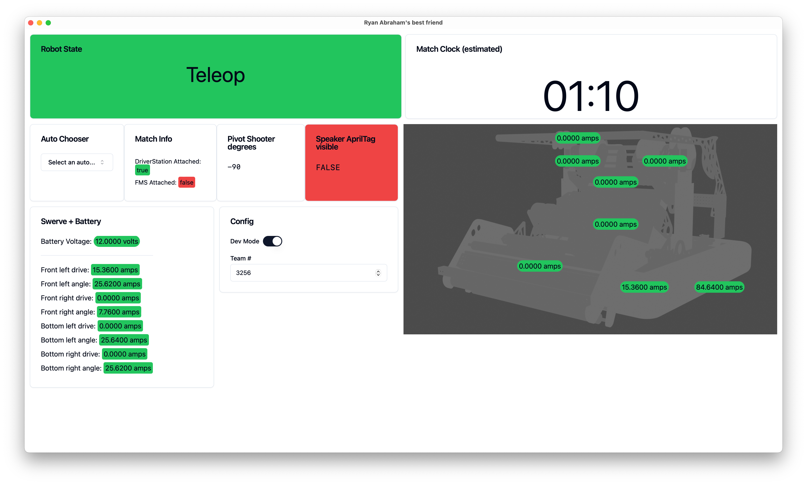
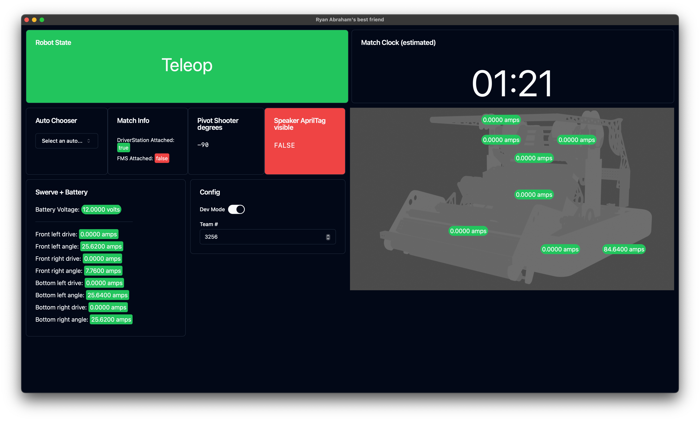

# WD

> WD stands for whatever you want it to stand for

Behold, in all of its glory:



Dark mode (adaptive to system settings):



## Developing

Once you've installed dependencies with `pnpm install`, start a development server:

```bash
pnpm run dev

# or start the server and open the app in a new browser tab
pnpm run dev -- --open
```

## Building

To create a production version of your app:

```bash
pnpm run build
```

You can preview the production build with `pnpm run preview`.
